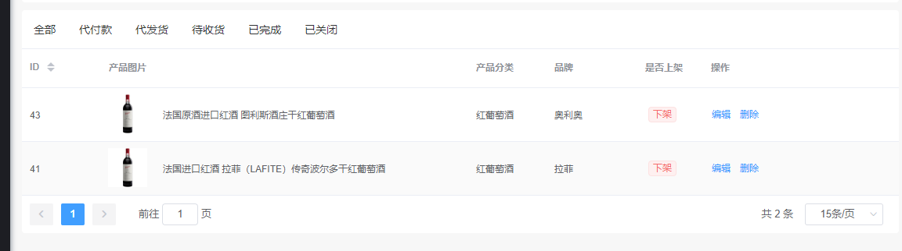

# 模型表格

使用[Elememt 的 Table](https://element.eleme.cn/#/zh-CN/component/table)实现，用于展示多条结构类似的数据，可对数据进行排序、筛选、对比或其他自定义操作。

## 使用示例

```php
use SmallRuralDog\Admin\Grid;

$grid = new Grid(new SeckillGoods());

//设置字段
$grid->column('order', '排序')->width(80);

//toolbar设置
$grid->toolbars(function (Grid\Toolbars $toolbars) {
    $toolbars->createButton()->content("添加商品");
});
//action设置
$grid->actions(function (Grid\Actions $actions) {
    $actions->hideEditAction();
});

return $grid;
```

## 属性设置

表格的相关属性

### 高度

Table 的高度，默认为自动高度。如果 height 为 number 类型，单位 px；如果 height 为 string 类型，则这个高度会设置为 Table 的 style.height 的值，Table 的高度会受控于外部样式。

```php
$grid->height('500px');
$grid->height(500);
```

### 最大高度

Table 的最大高度。合法的值为数字或者单位为 px 的高度。

```php
$grid->maxHeight('500px');
$grid->maxHeight(500);
```

### 斑马纹

是否为斑马纹 table

```php
$grid->stripe();
$grid->stripe(true);
$grid->stripe(false);
```

### 纵向边框

是否带有纵向边框

```php
 $grid->border();
 $grid->border(true);
 $grid->border(false);
```

### 尺寸

Table 的尺寸

可选择 `medium` `small` `mini`

```php
$grid->size('medium');
$grid->size('small');
$grid->size('mini');
```

### 宽度是否自撑开

列的宽度是否自撑开

```php
$grid->fit();
$grid->fit(true);
$grid->fit(false);
```

### 显示表头

是否显示表头

```php
$grid->showHeader();
$grid->showHeader(true);
$grid->showHeader(false);
```

### 高亮当前行

是否要高亮当前行

```php
$grid->highlightCurrentRow();
$grid->highlightCurrentRow(false);
```

### 空数据

空数据时显示的文本内容，只支持纯文本

```php
$grid->emptyText("暂无数据");
```

### TooltipEffect

tooltip effect 属性 。dark/light

```php
$grid->tooltipEffect('dark');
$grid->tooltipEffect('light');
```


### 多选

Table 多选

```php
$grid->selection();
```

### 预加载

更多使用请查看 [Laravel 预加载](https://learnku.com/docs/laravel/6.x/eloquent-relationships/5177#eager-loading)

```php
$grid->model()->with(['roles:id,name', 'roles.permissions', 'roles.menus']);
```

### 默认排序

当前模型的默认排序，不设置为`模型key desc`

```php
$grid->defaultSort('id', 'asc');
```

### 数据状态保存

把数据存入vue，默认为不保存

```php
$grid->dataVuex();
```

### 分页

设置 Table 的分页属性，默认`[10, 20, 30, 40, 50, 100]`

#### 每页大小组

```php
$grid->pageSizes([10, 20, 30, 40, 50, 100]);
```

#### 每页大小

默认 20

```php
$grid->perPage(20);
```

#### 背景色

是否为分页按钮添加背景色，默认`false`

```php
$grid->pageBackground();
```


### 快捷搜索
>快捷搜索是除了`filter`之外的另一个表格数据搜索方式，用来快速过滤你想要的数据，开启方式如下：
```php
$grid->quickSearch();
```
这样表头会出现一个搜索框

通过给`quickSearch`方法传入不同的参数，来设置不同的搜索方式，有下面几种使用方法
#### Like搜索
通过设置字段名称来进行简单的`like`查询
```php
$grid->quickSearch('title');
// 提交后模型会执行下面的查询
$model->where('title', 'like', "%{$input}%");
```
多个字段
```php
$grid->quickSearch('title', 'desc', 'content');

// 提交后模型会执行下面的查询

$model->where('title', 'like', "%{$input}%")
    ->orWhere('desc', 'like', "%{$input}%")
    ->orWhere('content', 'like', "%{$input}%");
```
更多用法可查看 [laravel-admin](https://laravel-admin.org/docs/zh/model-grid-quick-search)

#### 设置搜索框占位符
```php
$grid->quickSearchPlaceholder("占位符文字");
```
### 表单模式搜索

提供了一系列的方法实现表格数据的查询过滤：

```php
$grid->filter(function($filter){
    // 在这里添加字段过滤器
    $filter->like('name', 'name');
    
});
```

####  查询类型

目前支持的过滤类型有下面这些:

#### equal

`sql: ... WHERE`column`= "$input"`：

```php
$filter->equal('column', $label);
```

#### not equal

`sql: ... WHERE`column`!= "$input"`：

```php
$filter->notEqual('column', $label);
```

#### like

`sql: ... WHERE`column`LIKE "%$input%"`：

```php
$filter->like('column', $label);
```

#### ilike

`sql: ... WHERE`column`ILIKE "%$input%"`：

```php
$filter->ilike('column', $label);
```

#### contains

等于like查询

```php
$filter->contains('title');
```

#### starts with

查询以输入内容开头的title字段数据

```php
$filter->startsWith('title');
```

#### starts with

查询以输入内容结尾的title字段数据

```php
$filter->endsWith('title');
```

#### 大于

`sql: ... WHERE`column`> "$input"`：

```php
$filter->gt('column', $label);
```

#### 小于

`sql: ... WHERE`column`< "$input"`：

```php
$filter->lt('column', $label);
```

#### between

`sql: ... WHERE`column`BETWEEN "$start" AND "$end"`：

```php
$filter->between('column', $label);

// 设置datetime类型
$filter->between('column', $label)->datetime();

// 设置time类型
$filter->between('column', $label)->time();
```

#### in

`sql: ... WHERE`column`in (...$inputs)`：

```php
$filter->in('column', $label)->multipleSelect(['key' => 'value']);
```

#### notIn

`sql: ... WHERE`column`not in (...$inputs)`：

```php
$filter->notIn('column', $label)->multipleSelect(['key' => 'value']);
```

#### date

`sql: ... WHERE DATE(`column`) = "$input"`：

```php
$filter->date('column', $label);
```

#### day

`sql: ... WHERE DAY(`column`) = "$input"`：

```php
$filter->day('column', $label);
```

#### month

`sql: ... WHERE MONTH(`column`) = "$input"`：

```php
$filter->month('column', $label);
```

#### year

`sql: ... WHERE YEAR(`column`) = "$input"`：

```php
$filter->year('column', $label);
```

#### where

可以用where来构建比较复杂的查询过滤

`sql: ... WHERE`title`LIKE "%$input" OR`content`LIKE "%$input"`：

```php
$filter->where(function ($query) {

    $query->where('title', 'like', "%{$this->input}%")
        ->orWhere('content', 'like', "%{$this->input}%");

}, 'Text');
```

`sql: ... WHERE`rate`>= 6 AND`created_at`= {$input}`:

```php
$filter->where(function ($query) {

    $query->whereRaw("`rate` >= 6 AND `created_at` = {$this->input}");

}, 'Text');
```

关系查询，查询对应关系`profile`的字段：

```php
$filter->where(function ($query) {

    $query->whereHas('profile', function ($query) {
        $query->where('address', 'like', "%{$this->input}%")->orWhere('email', 'like', "%{$this->input}%");
    });

}, '地址或手机号');
```

#### 表单类型

请查看表单可用组件

```php
$filter->between("created_at", "名称")->component(DatePicker::make()->type("daterange"));
```

使用`component`方法设置表单类型

### 标签页模式搜索

例如：产品订单列表的 `全部 代付款 代发货` 等状态的快捷筛选



## 字段使用

Table 的数据列

### 创建

共有三个参数

- `prop` 对应列内容的字段名 支持 `.`来获取关联模型字段，需要设置`with`,如`user.name`
- `label` 显示的标题
- `column-key` 数据操作字段名，如排序。默认为`prop`的值

返回`Column`实例

```php
//基本使用
$grid->column('prop', 'label','column-key');
//属性设置
$grid->column('prop', 'label','column-key')->width("100");
```

### 属性

Column 相关属性设置，更多可查看 [Elment Table-column Attributes](https://element.eleme.cn/#/zh-CN/component/table)

#### class

列的 className

```php
$column->className('ClassName ClassName-2');
```

#### LabelClass

当前列标题的自定义类名

```php
$column->labelClassName('ClassName ClassName');
```

#### 宽度

对应列的宽度

```php
$column->width("100");
```

#### 最小宽度

对应列的最小宽度，与 width 的区别是 width 是固定的，min-width 会把剩余宽度按比例分配给设置了 min-width 的列

```php
$column->minWidth("300");
```

#### 固定

列是否固定在左侧或者右侧，true 表示固定在左侧

可选择 `true` `left` `right`

```php
$column->fixed(true);
$column->fixed('left');
$column->fixed('right');
```

#### 排序

对应列是否可以排序

```php
$column->sortable();
```

#### 内容过长

当内容过长被隐藏时显示 tooltip

```php
$column->showOverflowTooltip();
```

#### 对齐方式

可选 `left` `center` `right`

```php
$column->align('left');
$column->align('center');
$column->align('right');
```

#### 表头对齐方式

表头对齐方式，若不设置该项，则使用表格的对齐方式

可选 `left` `center` `right`

```php
$column->headerAlign('left');
$column->headerAlign('center');
$column->headerAlign('right');
```

### 帮助内容
会在列名称右边显示一个问号图标，鼠标放上去会显示设置的内容
```php
$column->help('帮助内容');
```

### 设置默认值

当获取不到字段值的时候显示的内容，默认为`null`

```php
$column->defaultValue("-")
```

### 显示组件

列的显示模式，默认显示纯文本形式
使用示例

```php
$column->component(Tag::make()->size("mini")->type("info"));
```


### 自定义数据

可以在后端自定义当前列的值
- `$row`当前数据行的所有值
- `$value`当前列的值

支持HTML标签

```php
//普通
$grid->column('name')->customValue(function ($row, $value) {
    return $value;
});
//一对一
$grid->column('user.name')->customValue(function ($row, $value) {
    //此时的value是name的值
    return $value;
});
//一对多
$grid->column('roles.name')->customValue(function ($row, $value) {
    //此时的value是 roles.name的值的数组
    return $value;
});
```


### 前缀/后缀

会在值的前后以字符串形式拼接

```php
$grid->column('name')->itemSuffix("折")
```


## 树形列表

>用清晰的层级结构展示信息，可展开或折叠。

此功能必须满足以下几点才能正常使用，暂不支持分页，所以不建议展示大量的数据，后期会加入异步加载

定义一个 `hasMany`管理，名称为`children`，并预加载所有`children`，设置好排序
```php
public function children() {
    return $this->hasMany(get_class($this), 'parent_id' )->orderBy('order')->with( 'children' );
}
```
以下代码开启树形展示模式
```php
$grid->model()->where('parent_id', 0);//设置查询条件
$grid->tree();//启动树形表格
$grid->rowKey('id');//设置rowKey，必须存在，默认为ID，如果你的Grid没有定义ID字段就要重新设置其他字段
$grid->defaultExpandAll();//默认展开所有行
```


## 关联模型
>要成功显示关联模型的值，必须设置`with`的值

要显示关联模型的值，使用`.`来获取关联模型的值，可以多级显示，最后一级为要显示的值
#### 一对一
```php
$grid->column('permissions.name');
```
#### 一对多
一对多最终得到的是数组，前端会自动循环展示，文本建议使用`Tag`组件，图片建议使用`Avatar`或`Image`组件
```php
$grid->column('permissions.name')->component(Tag::make()->type('info'));
```


## 行操作

```php
 $grid->actions(function (Grid\Actions $actions) {
    
    $actions->getKey();//获取当前行的 index v0.1.5 +
    
    $actions->getRow();//获取当前行的对象，注意是对象不是数组 v0.1.5 +
     
 	$actions->hideEditAction();
 	$actions->hideViewAction();
 })
```

#### 操作栏

##### 最小宽度

```php
$grid->actionWidth(180)
```

##### 操作栏固定

```php
$grid->actionFixed('right');// left | right
```

##### 操作栏对齐方式

```php
$grid->actionAlign('right');//left  right  center
```

##### 操作栏名称

> `v0.1.12 `以上版本

```php
$grid->actionLabel('操作');
```

#### 获取当前行的下标

 v0.1.5 +

```php
 $actions->getKey();
```

#### 获取当前行的对象

获取当前行的对象，注意是对象不是数组 v0.1.5 +

```php
$actions->getRow();
```

#### 隐藏所有操作

```php
$actions->hideActions()
```

#### 隐藏详情操作

当前版本暂无详情功能

```php
$actions->hideViewAction()
```

#### 隐藏编辑操作

```php
$actions->hideEditAction()
```

#### 隐藏删除操作

```php
$actions->hideDeleteAction()
```

#### 编辑/删除操作

基于el-button实现

```php
$actions->editAction()->disabled(true);//获取编辑操作实例，并置属性
$actions->deleteAction()->message("确定要删除吗，删除不可恢复？");//获取删除操作实例
```


#### 添加自定义操作

创建自定义操作请查看 [如何创建自定义操作](./custom?id=%e8%a1%a8%e6%a0%bc%e6%93%8d%e4%bd%9c%e7%bb%84%e4%bb%b6)

```php
$actions->add(new MyAction())
```

## 批量操作

```php
$grid->batchActions(function (Grid\BatchActions $batchActions) {
    $batchActions->hideDeleteAction();//隐藏批量删除操作
    $batchActions->add(...);//添加批量操作
});
```

#### 获取选择的keys

获取批量选择的keys

> 注意：获取原理为前段字符串替换，后端无法获取具体值

```php
$batchActions->getKeys();
```

可以在设置`url`时使用

```php
$url = $$batchActions->resource . '/' . $$batchActions->getKeys();
Grid\BatchActions\BatchAction::make("批量删除")->url($url);
```

可以在设置`dialog`里的`BaseForm`的`action`时使用

```php
$grid->batchActions(function (Grid\BatchActions $batchActions) {
        $batchActions->add(Grid\BatchActions\BatchAction::make("加入活动")->dialog(function (Dialog $dialog) use ($batchActions) {
            $dialog->slot(function (Content $content) use ($batchActions) {
            $form = new BaseForm();
                
            $actionUrl = route('activityJoin', ['keys' => $batchActions->getKeys()]);
            $form->action($actionUrl);
                
            $form->item('activity_id', '活动');
            $content->row($form);
        });
    }));
});
```


## 工具栏

```php
$grid->toolbars(function (Grid\Toolbars $toolbars) {

	$toolbars->hideCreateButton();
    $toolbars->createButton()->content("添加商品");//获取创建组件实例，修改属性
});
```

#### 隐藏创建按钮

```php
$toolbars->hideCreateButton()
```

#### 添加自定义工具

详情请看[如何创建自定义工具](https://smallruraldog.github.io/laravel-vue-admin/#/custom?id=%e8%a1%a8%e6%a0%bc%e5%b7%a5%e5%85%b7%e6%a0%8f%e7%bb%84%e4%bb%b6)

```php
$toolbars->addLeft(new MyLeftTool());//添加在左侧
$toolbars->addRight(new MyRoghtTool());//添加在右侧
```


## 头部内容

可自定义Grid顶部内容，闭包返回一个content组件

```php
 $grid->top(function (Content $top){
 	$top->body(Card::make()->content(Html::make()->html("我是头部内容")));
 });
```


## 底部内容

可自定义Grid底部内容，闭包返回一个content组件

```php
 $grid->bottom(function (Content $bottom){
 	$bottom->body(Card::make()->content(Html::make()->html("我是头部内容")));
 });
```

