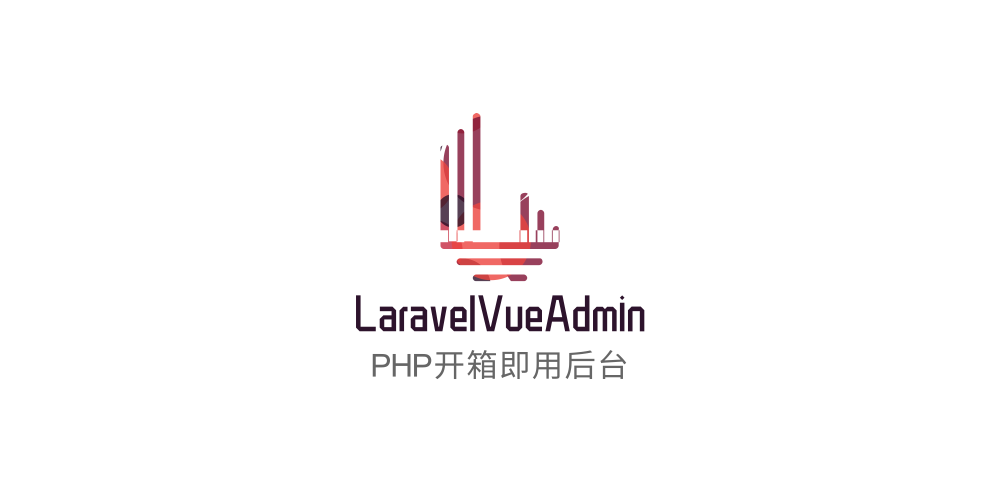

Laravel-Vue-Admin 是一个开箱即用的Laravel后台扩展

前后端分离，简单的几行代码即可创建一个`vue`+`vuex`+`vue-route`+`elment-ui`+`laravel`的项目

内置了丰富的`表单` `表格`组件

最核心的是强大的自定义组件功能


[开发者文档](https://www.yuque.com/smallruraldog/laravel-vue-admin/overview)
## 安装
首先确保安装好了laravel，并且数据库连接设置正确。

``` bash
composer require smallruraldog/laravel-vue-admin
```

然后运行下面的命令来发布资源：
``` bash
php artisan vendor:publish --provider="SmallRuralDog\Admin\AdminServiceProvider"
```
在该命令会生成配置文件`config/admin.php`，可以在里面修改安装的地址、数据库连接、以及表名，建议都是用默认配置不修改。
然后运行下面的命令完成安装：
``` bash
php artisan admin:install
```
启动服务后，在浏览器打开 `/admin` ,使用用户名 admin 和密码 admin登录.

## 版本升级

 查看当前版本
```bash
composer show smallruraldog/laravel-vue-admin --latest
```
 更新到最新版
```bash
composer require smallruraldog/laravel-vue-admin
```
 更新到开发版
```bash
composer require smallruraldog/laravel-vue-admin:dev-master
```
更新资源文件

发布静态资源文件(必须)
```bash
php artisan vendor:publish --tag=laravel-vue-admin-assets --force
```
```bash
// 发布语言包文件
php artisan vendor:publish --tag=laravel-vue-admin-lang --force

// 清理视图缓存
php artisan view:clear
```
最后不要忘记清理浏览器缓存，如果有CDN也要更新CDN的缓存

# 感谢

- [ZFont找字体](http://zfont.cn)


# 交流


# 支持

如果你觉得 Laravel-Vue-Admin 节省了你的开发时间，让你少加班，让你能更早的回家陪女友或者打游戏，能让你更快速的挣到钱，那么请支持我，让我能继续的将 Laravel-Vue-Admin 做好，做下去！
